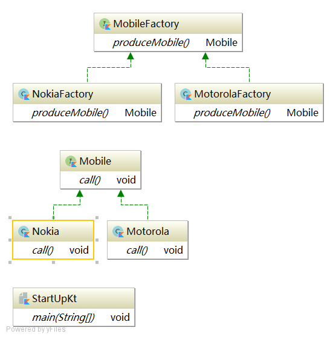

# 工厂模式
[百度百科 工厂模式](https://baike.baidu.com/item/%E5%B7%A5%E5%8E%82%E6%96%B9%E6%B3%95%E6%A8%A1%E5%BC%8F/2361103?fr=aladdin)
## 模式简介
工厂方法(Factory Method)模式的意义是定义一个创建产品对象的工厂接口，将实际创建工作推迟到子类当中。核心工厂类不再负责产品的创建，这样核心类成为一个抽象工厂角色，仅负责具体工厂子类必须实现的接口，这样进一步抽象化的好处是使得工厂方法模式可以使系统在不修改具体工厂角色的情况下引进新的产品。

## 角色结构
抽象工厂(Creator)角色：是工厂方法模式的核心，与应用程序无关。任何在模式中创建的对象的工厂类必须实现这个接口。

具体工厂(Concrete Creator)角色：这是实现抽象工厂接口的具体工厂类，包含与应用程序密切相关的逻辑，并且受到应用程序调用以创建产品对象。在上图中有两个这样的角色：BulbCreator与TubeCreator。

抽象产品(Product)角色：工厂方法模式所创建的对象的超类型，也就是产品对象的共同父类或共同拥有的接口。在上图中，这个角色是Light。

具体产品(Concrete Product)角色：这个角色实现了抽象产品角色所定义的接口。某具体产品有专门的具体工厂创建，它们之间往往一一对应。

## 模式应用
工厂方法经常用在以下两种情况中:
第一种情况是对于某个产品，调用者清楚地知道应该使用哪个具体工厂服务，实例化该具体工厂，生产出具体的产品来。Java Collection中的iterator() 方法即属于这种情况。

第二种情况，只是需要一种产品，而不想知道也不需要知道究竟是哪个工厂为生产的，即最终选用哪个具体工厂的决定权在生产者一方，它们根据当前系统的情况来实例化一个具体的工厂返回给使用者，而这个决策过程这对于使用者来说是透明的。

#### 示例:
抽象工厂：MobileFactory  

具体工厂: MotorolaFactory , NokiaFactory

抽象产品: Mobile

具体产品: Nokia,Motorola
#### UML图

